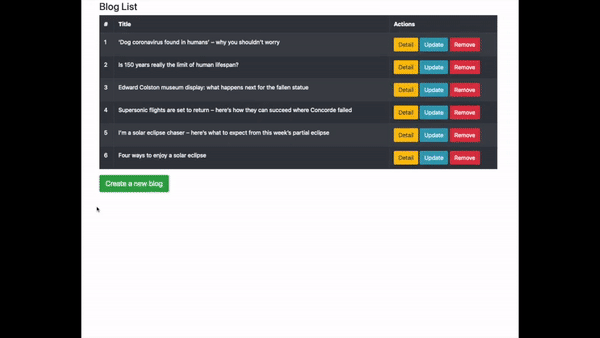

# ReactJS Blog

A boilerplate application developed with Hooks + Redux for CRUD operations.

Tools that I used while developing the project are; Eslint, Prettier, Husky, Babel, Webpack, Jest, fake-api

## Table of Contents
- [Project Overview](#projectoverview)
- [Installation](#installation)
- [Test](#test)
- [Structure](#structure)
- [Support](#support)
- [Contributing](#contributing)


### ProjectOverview
A short overview of the project



## Installation
### with Docker
```sh
git clone https://github.com/mJiyan/reactjs-blog.git
cd reactjs-blog
docker-compose up
```

### manually
```sh
git clone https://github.com/mJiyan/reactjs-blog.git
cd reactjs-blog
yarn
yarn start
```


## Test
```sh
git clone https://github.com/mJiyan/reactjs-blog.git
cd reactjs-blog
yarn
yarn test
```

## Structure
```
├─ __test__
│  ├─ setup
│  │  └─ setupTest.js
│  └─ BlogList.test.js
├─ .huksy
│  ├─ pre-commit
│  └─ pre-push
├─ public
│  └─ index.html
│
├─ src
│  ├─ @fake-api
│  │  └─ db.json
│  │
│  ├─ components
│  │  ├─ Modals
│  │  │  ├─ AddEditBlogModal.jsx
│  │  │  └─ RemoveBlogModal.jsx
│  │  └─ index.js
│  │
│  ├─ redux
│  │  ├─ actions
│  │  │  └─ Blog
│  │  │     ├─ index.js
│  │  │     └─ types.js
│  │  └─ reducers     
│  │     ├─ Blog
│  │     │  └─ index.js
│  │     └─ index.js
│  │
│  ├─ routes
│  │  └─ index.js
│  │
│  ├─ services
│  │  ├─ api.js
│  │  └─ constants.js
│  │
│  ├─ views
│  │  ├─ Blog
│  │  │  ├─ BlogDetail.jsx
│  │  │  └─ BlogList.jsx
│  │  └─ index.js
│  │
│  ├─ configureStore.js
│  ├─ index.js
│  └─ reducers.js
│
├─ .dockerignore
├─ .eslintrc
├─ .gitignore
├─ .prettierrc
├─ babel.config.js
├─ docker-compose.yaml
├─ Dockerfile
├─ jest.config.js
├─ LICENSE
└─ package.json
└─ webpack.config.js
```


## Support

Please [open an issue](https://github.com/mJiyan/reactjs-blog/issues) for support & suggestions.

## Contributing

Please contribute using [Github Flow](https://guides.github.com/introduction/flow/). Create a branch, add commits, and [open a pull request](https://github.com/mJiyan/reactjs-blog/compare).